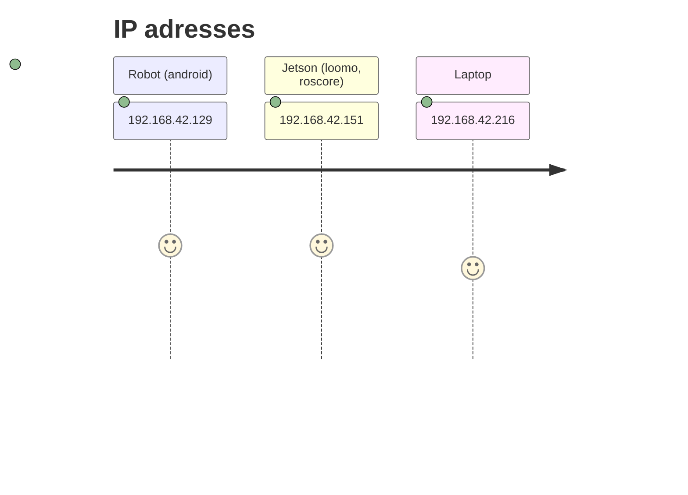

# ROS `loomo_base` package
🤖 Segway Ninebot Loomo ROS control


## Build
Use the following commands to download and compile the package. [Catkin_tools](https://catkin-tools.readthedocs.io/en/latest/installing.html) is recommended, but catkin_make also works.
```
cd catkin_ws/src/
git clone https://github.com/jkk-research/loomo_base
 git clone https://github.com/szenergy/rviz_markers
catkin build loomo_base rviz_markers
```
Don't forget to source 😉

## Run 
```
roslaunch loomo_base joystick_control.launch
```

# Troubleshoot
```
sudo apt-get install ros-melodic-joy
```

## Further readings 
- https://github.com/mit-acl/android_loomo_ros_core





```
ssh loomo@192.168.42.151
```

## Create Waypoints

To create waypoints to the loomo, you first have to ssh into the Jetson and start `roscore`.
After that you need to use the `rosrun loomo_base loomo_odom.py ` command to initialize the starting position of the robot.
From this point you can create your waypoints by simply using the *waypoint_creator.py* in your workspace.
In rviz you need to use the *2D Nav Goal* and mark the points you want the robot to go.
Finally to start the process you just need to start *waypoint_loomo.py* and the robot will go to the marked points.

## Issues
- Every time you turn on the Jetson, you first have to synchronize its time with the robot and the computer you are using, otherwise the tf messages won't work on `rviz`.
- If the *loomo_odom.py* stops working you can use the previously added position by simply using `rosrun loomo_base loomo_odom.py --prev` command.